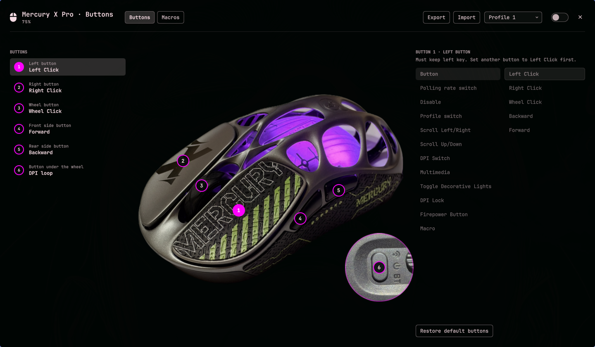
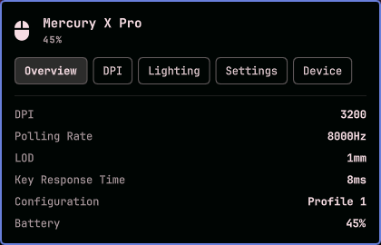
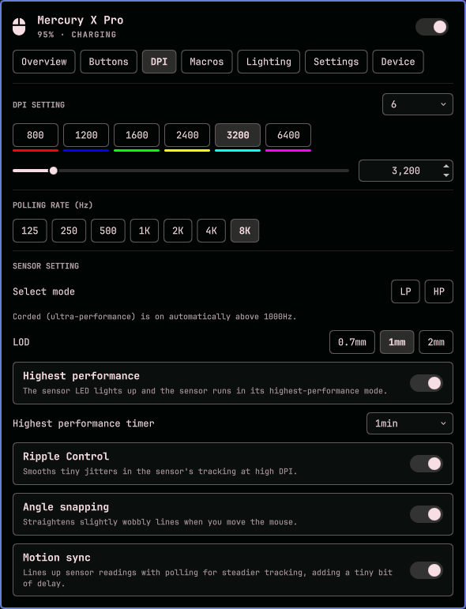
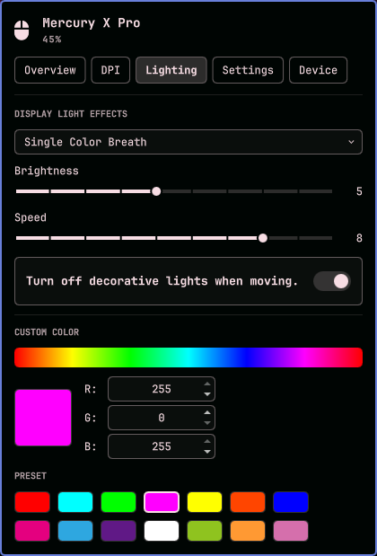
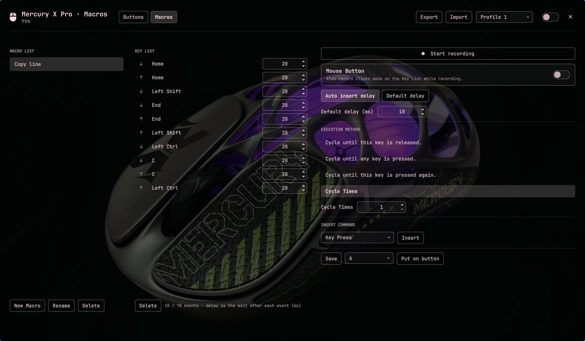
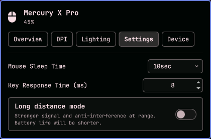
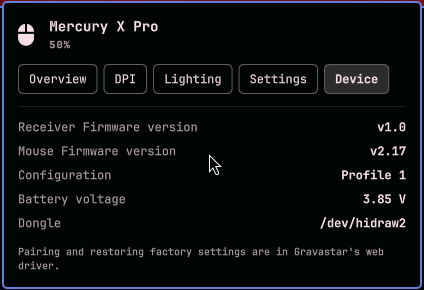

# OmaGravastar

**Gravastar Mercury X Pro controls in the Omarchy bar, not a web app.**

OmaGravastar is a Quickshell plugin: a mouse icon on the bar that shows your
battery when you hover it, a dropdown with every setting from Gravastar's web
driver, and a larger window for buttons and macros. It talks to the mouse
through its 2.4G dongle, works offline, and follows your Omarchy theme.



Plugin id: `io.github.dankestrick.omagravastar`

## What it does

The dropdown has one tab per page of Gravastar's web driver:

| Tab | Settings |
| --- | --- |
| **Overview** | DPI, polling rate, LOD, key response time, battery, **profile** (1-4), **Export** and **Import** |
| **Buttons** | Opens the Buttons window (below) |
| **DPI** | Number of DPI stages, each stage's DPI and color, active stage, polling rate (125Hz to 8000Hz), Select mode (LP / HP), LOD (0.7mm / 1mm / 2mm), Highest performance and its timer, Ripple Control, Angle snapping, Motion sync |
| **Macros** | Your macros, and a button to open the Macros window |
| **Lighting** | Effect (Off, Rainbow, Single Color Breath, Fixed Color, Neon, Rainbow Breath, Fixed Rainbow), Brightness, Speed, turn off lights when moving, color picker with presets |
| **Settings** | Mouse Sleep Time, Key Response Time, Long distance mode |
| **Device** | Receiver and mouse firmware versions, battery voltage |

| Overview | DPI | Lighting |
| --- | --- | --- |
|  |  |  |

The bar icon's tooltip shows the battery, for example `Mercury X Pro · 45%`,
plus **Charging** or **Asleep** when that applies. You get a notification when
the battery drops to 25% and again at 15%.

### Buttons window

Click the **Buttons** tab to open a larger window. Pick a button from the list
or click its number on the photo, then choose what it does:

- **Button**: Left Click, Right Click, Wheel Click, Backward, Forward
- **DPI Switch**: DPI loop, DPI +, DPI -
- **Scroll**: Scroll Up/Down, Scroll Left/Right
- **Multimedia**: 18 keys, including Play/Pause, Next and Previous Track, Mute and Volume
- **Toggle Decorative Lights**, **Polling rate switch**, **Profile switch**, **Disable**
- **Firepower Button**: repeat left clicks (times and interval)
- **DPI Lock**: hold 100 to 1000 DPI while the button is down
- **Macro**: any macro from the Macros window

One button always stays on Left Click, like the web driver, so you can't lock
yourself out. The numbered markers take the mouse's own **Fixed Color** from the
Lighting tab.

### Macros window



The Macros window follows the web driver's macro page: a macro list, a key list
with a delay after each event, **Start recording** (keys, and mouse clicks with
**Mouse Button** on), auto or fixed delays, **Insert command**, and the
execution method (Cycle Times, or cycle until the key is released, until any
key is pressed, or until it is pressed again). **Put on button** writes the
macro to a button.

Gravastar's web driver keeps its macro list in the browser, and the mouse only
stores macros that are on a button. OmaGravastar keeps its list in
`~/.config/omagravastar/macros.json`, and macros already on your mouse's
buttons show up in it automatically.

### Profiles, Export and Import

The mouse has 4 onboard profiles. **Each profile keeps its own copy of every
setting**: DPI, polling rate, lighting, sensor settings, sleep time and buttons.
Switch with the **Profile** menu on the Overview tab or in the big window.

**Export** saves the current profile to a `.bin` file, and **Import** loads one
into the current profile. The files use the same format as Gravastar's web
driver, so they move both ways. Import checks the file is for this mouse and
backs up the current profile to `~/.cache/omagravastar/backups/` before it
changes anything.

### When the mouse is asleep

The mouse sleeps after the **Mouse Sleep Time** without moving (10 seconds to
15 minutes), and it can't answer while it sleeps. The dropdown and window keep
showing your last settings, greyed out, and ask you to move the mouse to change
them.

| Settings | Device |
| --- | --- |
|  |  |

## Install

You need [Omarchy](https://omarchy.org) 4, a Gravastar Mercury X Pro with its
2.4G dongle plugged in, Python 3 (Omarchy already has it), and `zenity` for the
Export and Import file pickers.

**1. Add the plugin.**

```bash
omarchy plugin add https://github.com/Dankestrick/OmaGravastar.git --enable
```

That clones into `~/.config/omarchy/plugins/io.github.dankestrick.omagravastar/`
and places the icon on the **right** of the bar. To move it:

```bash
omarchy bar move io.github.dankestrick.omagravastar --section right
```

**2. Let your session talk to the dongle (one time, needs root).** Linux lets
only root use the mouse's settings channel until a udev rule allows it. The
rule ships with the plugin in
[`udev/70-gravastar-mouse.rules`](udev/70-gravastar-mouse.rules), so you can
read it first. Copy it into place and reload udev:

```bash
sudo install -m 0644 ~/.config/omarchy/plugins/io.github.dankestrick.omagravastar/udev/70-gravastar-mouse.rules /etc/udev/rules.d/
sudo udevadm control --reload-rules && sudo udevadm trigger
```

This is the only step that needs root. See
[Permissions and safety](#permissions-and-safety) for exactly what it allows.

**3. Make the big window float.** Add this to `~/.config/hypr/hyprland.lua` so
the Buttons and Macros window opens as a centered floating window instead of a
tiled one:

```lua
o.window({ title = "^OmaGravastar$" }, {
  float = true,
  size = { 1440, 840 },
  center = true,
})
```

Do not symlink a git checkout into the plugins folder. Omarchy rejects a
plugin tree that is a symlink.

## Permissions and safety

OmaGravastar runs as a normal Omarchy plugin, with your user's permissions.

- **One root step, at install.** Step 2 copies one udev rule into
  `/etc/udev/rules.d/`. After that, OmaGravastar never runs `sudo`, `pkexec` or
  any other privileged command, and it installs no services or sudoers rules.
- **What the rule allows.** It matches only the Gravastar dongle's hidraw nodes
  (USB `3554:f54b`) and tags them `uaccess`, which gives the user at the
  active local session read and write access, the same way Linux handles game
  controllers. No other device is affected, and the dongle is not opened to
  other users.
- **What it talks to.** Only the dongle's settings channel, found by vendor,
  product and usage page. It makes no network connections.
- **What it writes.** Your settings go to the mouse. On disk it writes only
  `~/.cache/omagravastar/` (last known settings and import backups),
  `~/.config/omagravastar/macros.json` (your macro list), a lock file in
  `$XDG_RUNTIME_DIR/omagravastar/`, and profile files where you choose to save
  them.
- **What it runs.** Its own helper (`helpers/omagravastarctl`, plain Python),
  `notify-send` for battery alerts, and `zenity` for the Export and Import
  file pickers.

## Use

| Action | What happens |
| --- | --- |
| Hover the bar icon | Battery, charging and asleep state |
| Left-click the bar icon | Open or close the dropdown |
| Right-click the bar icon | Read the mouse again |
| `←` / `→` in the dropdown | Switch tabs |
| Switch at the top of the dropdown | Open the Buttons window |
| Switch at the top of the window, or `M` | Back to the dropdown, on the same monitor |
| `↑` / `↓` or `1`-`6` in the Buttons window | Pick a button |
| `Esc` | Close the dropdown or window (stops recording in the Macros window) |

Changes go to the mouse right away. OmaGravastar reads each one back to make
sure the mouse kept it, so what you see is what the mouse really has.

Turning on **Long distance mode** asks first, like the web driver, because it
shortens battery life.

Not in OmaGravastar: **Combo key**, pairing, and restoring factory settings.
Use Gravastar's web driver for those.

## Troubleshooting

| Problem | Fix |
| --- | --- |
| "Dongle not found" | Plug the dongle in. Check that `lsusb` lists `3554:f54b`. |
| "No permission to open /dev/hidraw…" | Do install step 2, then unplug and replug the dongle. |
| Settings are greyed out | The mouse is asleep. Move it. |
| The big window opens tiled or on the scratchpad | Add the window rule from step 3. Windows open inside the scratchpad while it is showing. |

The helper also works from a terminal, which helps when reporting a problem:

```bash
~/.config/omarchy/plugins/io.github.dankestrick.omagravastar/helpers/omagravastarctl status
```

## Remove

```bash
omarchy plugin remove io.github.dankestrick.omagravastar --yes
```

That removes the plugin files and the bar icon. Omarchy keeps a backup copy
named `~/.config/omarchy/plugins/.io.github.dankestrick.omagravastar.bak.<date>`,
which you can delete. It leaves the udev rule, the window rule, your macro list
and the settings cache. To remove those too:

```bash
rm -rf ~/.cache/omagravastar ~/.config/omagravastar
```

Removing the udev rule needs root, like installing it:

```bash
sudo rm -f /etc/udev/rules.d/70-gravastar-mouse.rules
sudo udevadm control --reload-rules && sudo udevadm trigger
```

Then delete the `OmaGravastar` window rule from `~/.config/hypr/hyprland.lua`.
Profiles you exported stay in `~/Documents/OmaGravastar`.

Your mouse keeps whatever settings you last chose. They are stored on the
mouse, not in the plugin.

## Develop from a clone

`scripts/install.sh` copies `manifest.json`, `qml/`, `helpers/`, `assets/` and `udev/`
into the live plugin folder. Use it while hacking, not as the public install.

```bash
git clone https://github.com/Dankestrick/OmaGravastar.git
cd OmaGravastar
./scripts/install.sh
omarchy restart shell
./scripts/validate.sh
```

The shell keeps the old QML loaded until it restarts, so run
`omarchy restart shell` after QML changes. Helper changes apply right away.

`research/` holds the scripts and settings dumps used to map the mouse's
protocol. `helpers/omagravastarctl --help` lists every command.

## Credits

The mouse speaks the same CompX protocol as VGN, VXE and ATK mice.
[OpenMouse](https://github.com/OpenMouse-Project/openmouse) documented its
commands and settings layout, which made this plugin possible. Everything else
(lighting, sleep time, long distance mode, Select mode, profiles, buttons,
macros, Firepower, DPI Lock and the export format) was mapped on a real
Mercury X Pro against Gravastar's web driver.

The pictures in `assets/` are photos of Dankestrick's own Mercury X Pro
and are covered by this repo's MIT license.

The bar icon and dropdown layout follow
[omarchy-wlmouse](https://github.com/LarsLarkin/omarchy-wlmouse).

## License

[MIT](LICENSE) © 2026 Dankestrick.
